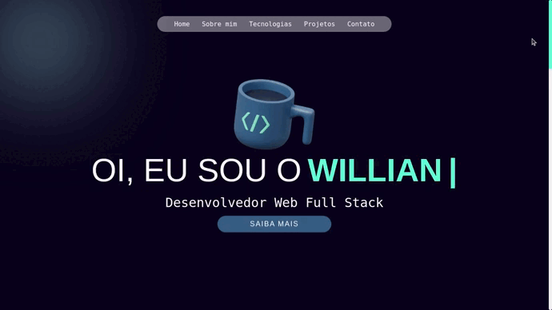

### Observação

Este repositório contem o **Portfólio Web** que reúne o aprendizado desenvolvido por _[Willian Alves Batista](https://www.linkedin.com/in/willian-alves-batista-60aa6a180/)_.

# Portfólio Web
### Resultado obtido:
### Deploy do Projeto: [Portfólio Web](https://portfolio-web-willian-alves.vercel.app/)

#### Habilidades que foram exigidas:

  - Logica de programação;

#### Tecnologias utilizadas: 

  - React/Next;
  - TypeScript;
  - Styled-Components
  - HTML;
  - CSS;
  - Eslint;

---
